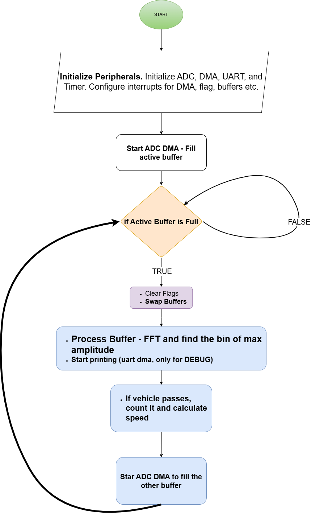

# Radar - Diploma Thesis

## Introduction
Implementation of a low power radar device. Project for diploma thesis for ECE NTUA 

## Prerequisites
- STM32 Cube IDE installed. If you haven't it, you can download it [here.](https://www.st.com/en/development-tools/stm32cubeide.html)
- Microcontroller: Stm32 NUCLEO-F429: https://www.st.com/en/evaluation-tools/nucleo-f429zi.html
- Module: Radar RFBeam - KMC-1: https://rfbeam.ch/product/k-mc1-radar-transceiver/

## Flow chart:

## Project status
Stable, working version.

Last Updated 27/12/2024
